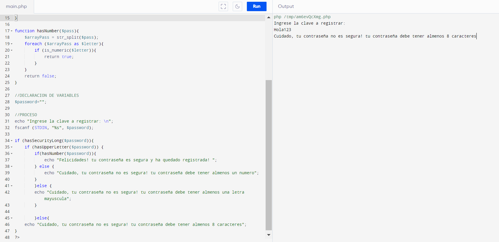
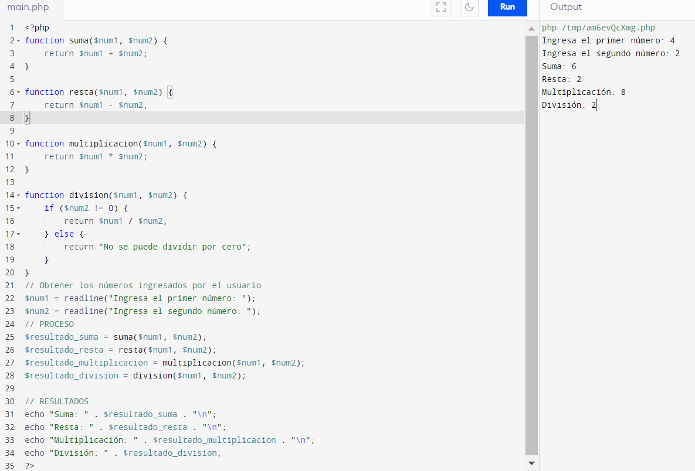

<h1>Taller 1 Luis Hernando Lopez Galindo </h1>

<h2> Información</h2>

Curso: full Stack Básico - Grupo 1 

Profesor: Cristian Patiño

<h2> Punto 1: Constantes y Variables</h2>

<h2> Punto 2: Suma de constante y variable</h2>

<h2> Punto 3: Suma de 2 números ingresados por el usuario</h2>

<h2> Punto 4: Nombre y apellido del usuario</h2>

<h2> Punto 5: Calculo de pago en Bolera con IF</h2>

<h2> Punto 6: Usuario mayor o menor de edad</h2>

<h2> Punto 7: Operaciones básicas entre 2 números</h2>

<h2> Punto 8: Calculo de pago en Bolera con SWITCH</h2>

<h2> Punto 9: Tabla del 0 al 30 WHILE</h2>

<h2> Punto 10: Números pares del 0 al 100 WHILE</h2>

<h2> Punto 11: Números pares del 0 al 100 For</h2>

<h2> Punto 12: Tabla del 0 al 30 FOR</h2>

<h2> Punto 13: Suma de un arreglo</h2>

<h2> Punto 14: Revisión de contraseña</h2>

<h2> Punto 15: Operaciones básicas entre 2 números con funciones</h2>

<h2> FIN </h2>